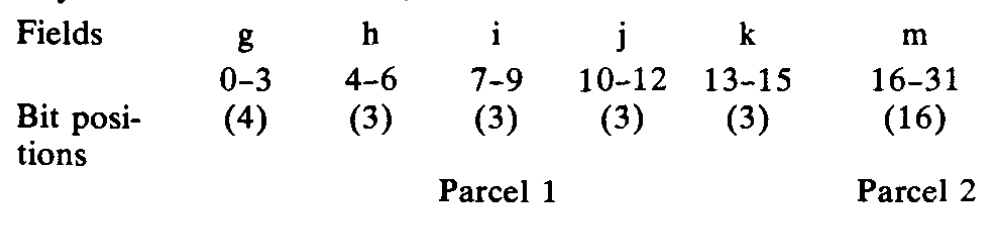

# Notes for The CRAY-1 Computer System

## 简介

CRAY-1的体系结构设计的目的是满足在离散步骤中执行许多计算的计算需求，==每个步骤都会产生用于后续步骤的临时结果==。通过一种称为==“链接”==的技术，CRAY-1矢量功能单元与标量和矢量寄存器相结合，可以生成临时结果，并==立即使用==它们而无需额外的内存。其他提升其性能的原因有：

- 体积小巧，减少了电信号传播距离
- 1M的半导体存储器，具有错误检测和矫正逻辑
- 使用64位寻址空间
- 对Fortran进行了优化的编译器

---

## 架构

图1 为CRAY-1的物理外观，底座下面是电源，整个

CRAY-1包括==113种类型共1662个模块==，每个模块

包含至多==228个芯片==，最大电压115kw，使用氟利昂降温，具有三种类型的内存，包含三类元件：

- 5/4 与非门
- 内存
- 寄存器

---

## 分析

表1列出了CRAY-1计算机系统的参数

CRAY-1最大的特点是：

- 只有==4种类型的器件==
  - $16 \times 4$ bit 双极寄存器
  - $1024 \times 1$ bit 双极内存
  - 逻辑元件均为5/4与非门构成
  - 发射极耦合电路芯片

- **高速主存**
  - 存储器被组织在16个分块中，每个分块包含72个模块。每个模块为一个64位字贡献1位。其他8位用来存储一个8位检查字节，需要单位错误校正，双位错误检测。
- **冷却系统**
  - 采用氟氯昂和金属导体进行冷却
- **计算部件**
  - ==功能部件==，12个分成4组：地址、标量、向量和浮点数功能部件
  - ==寄存器==：CRAY-1具有大量的寄存器，如果矢量寄存器空间无法用于存储最终或中间结果，则无法进行链接
  - ==指令格式==：
    - **算术和逻辑指令**，一个7位运算码(gh)后面跟着三个3位寄存器指示器。
    - **移位和掩码指令**由一个7位操作码(gh)组成，后面跟着一个3位i字段和一个6位jk字段。i字段指定操作数寄存器。jk组合字段指定一个移位或掩码计数。
    - **立即数和读和存储内存指令**组合j、k和m字段来定义一个22位的数量或内存地址。此外，读和存储内存指令使用h字段来指定一个用于索引的操作寄存器。
    - **分支指令**将i、j、k和m字段组合成一个24位内存地址字段。这允许分支到任何64位字中的四个包位置中的任何一个，无论是在内存中还是在指令缓冲区中。
  - ==操作寄存器==
    - CRAY-1提供5类寄存器，3个主寄存器（A，S，V）和2个中间寄存器（B，T）
      - A寄存器：主要用作内存引用的地址寄存器和索引寄存器，但也用于提供移位计数、循环控制和通道i/o操作的值
      - B寄存器：被用作A寄存器的辅助存储
      - S寄存器：标量操作的主要数据处理寄存器
      - T寄存器：用作S寄存器的辅助存储
      - V寄存器：以一个时钟周期的速率向功能单元提供操作数并从功能单元接收结果
      - 其他寄存器
  - ==链接操作==
    - 链接技术利用了各功能单元的==并行操作==
    - 中间结果==不必存储到内存==中，甚至可以在创建它们的向量操作运行到完成之前使用
    - ==自动==发生
  - ==中断和交换序列==
    - 当检测到中断条件时，指令发出被硬件终止，所有的存储活动都完成，然后一个交换序列被激活
    - 

---

