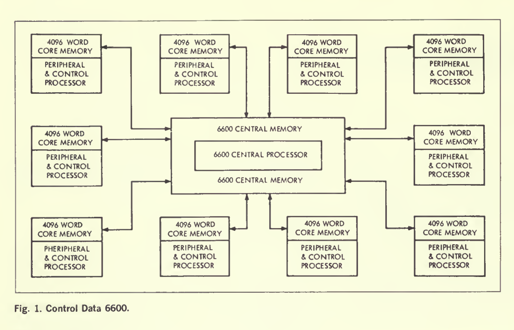
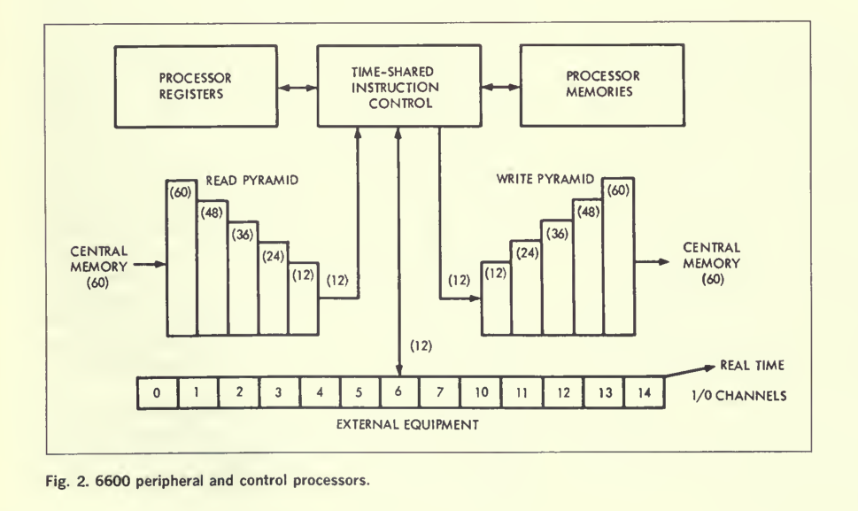
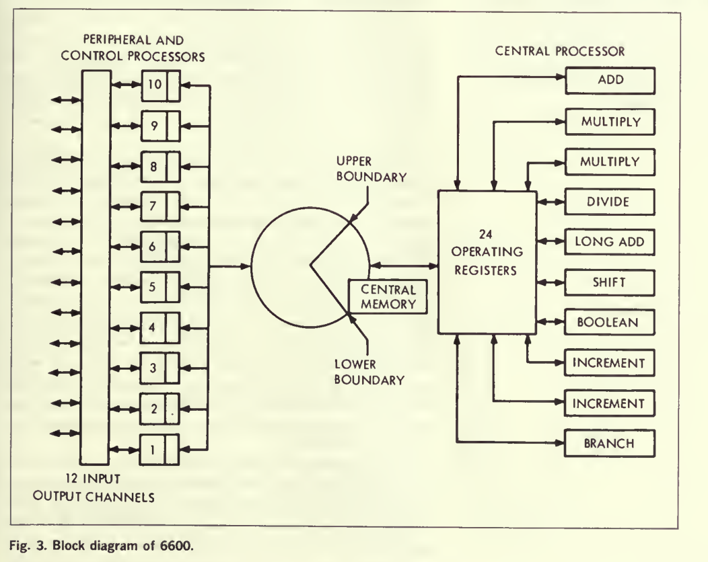
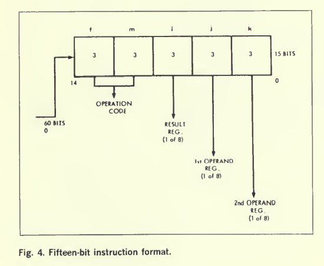
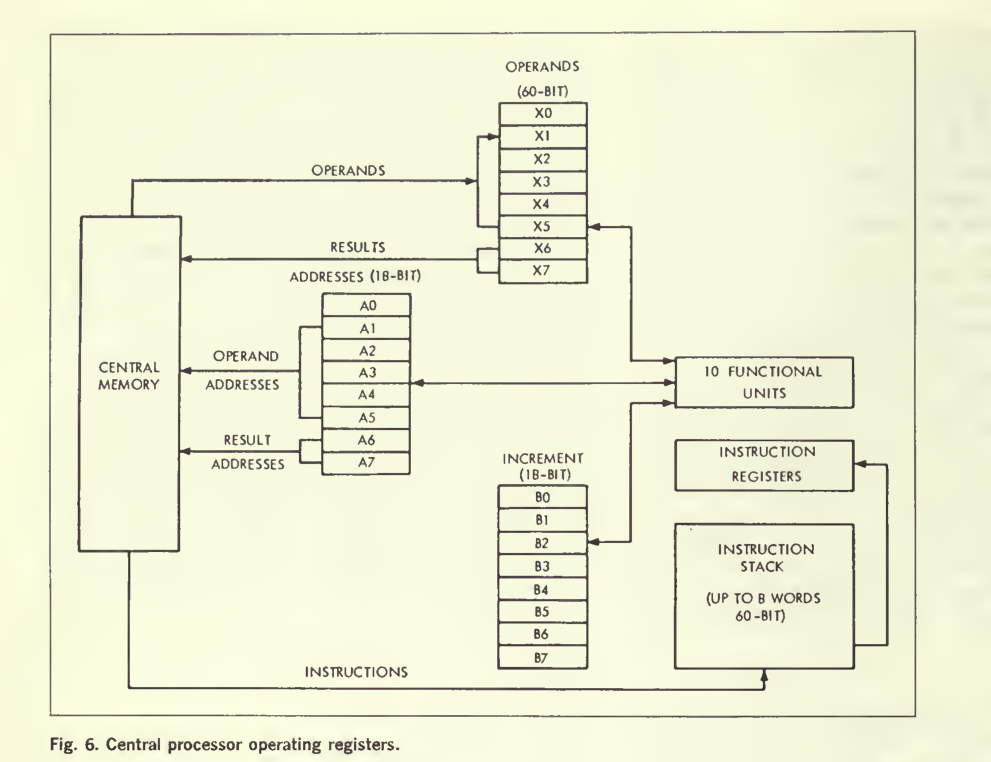
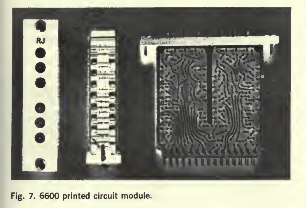
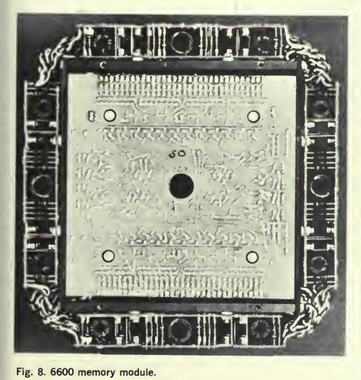
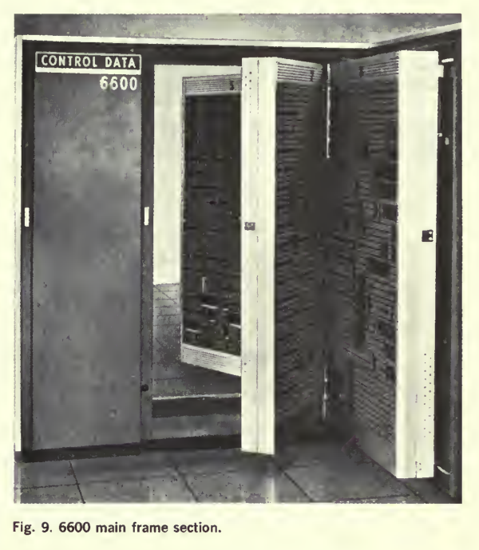
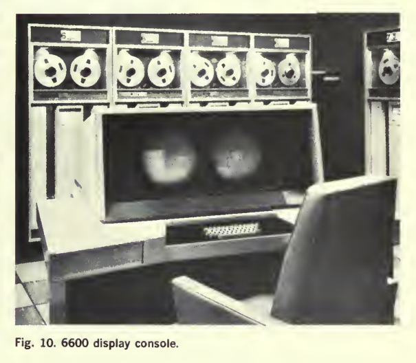

### Control Data中的并行操作
James E.Thornton

#### 历史
- 1960年项目开始，交付了第一台6600计算机，强力电路性能(brute force circut)和并行操作(parallel operation)是任何先进计算机的两个主要途径。高速硅晶体管的出现支持了电路性能的提高。
- 本文介绍了与6600并行操作有关的一些考虑。

#### 系统组织
6600特别关注两种用途：
- **非常大的科学问题**：一个可以访问大容量中央存储器的高速浮点中央处理器；将中心运算与外围活动分隔开来；
于是形成多重外围处理器的思想
*十个这样的外围处理器一边可以访问中央存储器，另一边可以访问外围通道。系统的执行控制总是在这些外围处理器中的一个中，而其他的在指定的外围或控制任务上运行。所有十个处理器都可以访问十二个输入输出通道，并且可以“换手”，监视通道活动，以及执行其他相关的工作。这些处理器可以访问中央存储器，并且可以在该存储器中进行独立的数据传输。十个外围处理器中的每一个都包含自己的程序和缓冲区内存，从而隔离和保护独立处理器中更关键的系统控制操作。中央处理器从中央存储器操作，为中央存储器中的每个程序提供重新定位寄存器和文件保护。*

- **小问题的时间共享**

#### 外围设备和控制处理器
1. **外围设备和控制处理器**安装在主框架的一个底盘上。
*每个处理器包含4096个12位长度的内存。有12位和24位指令格式可以提供直接、间接和相对寻址。指令提供逻辑、加法、减法、移位和条件分支。指令还提供进出任何十二个外围通道的单个字或块传输，以及进出中央存储器的单个字或块传输。60位长的中心记忆单词由五个连续的外围单词组成。每个处理器都有中断中央处理器和监控中央程序地址的指令。*
2. 为了以合理的经济和空间获得如此大的处理能力，采用了**分时设计**。

其中，桶中的一个“槽”包含加法器、组装网络、分配网络和互连，以执行一步外围指令。穿过一个槽一百纳秒，读写周期相当于一次绕“桶”的完整旅行，需要一千纳秒。

1. **输入输出通道**是双向12位路径。在每个通道上，一个12位字可以在每个主周期或1000纳秒内沿一个方向移动。因此，使用所有十个外围处理器，每秒1.2亿比特的最大突发速率是可能的。外围设备和控制处理器通过组件网络和分解网络访问中央存储器。

2. 所有外围处理器都可以使用一个**连续运行的实时时钟**。

#### 中央处理器
6600中央处理器可能被认为是系统的高速运算单元
。
1. 它的程序、操作数和结果保存在中央存储器中。除了通过内存和两个单独的控制器之外，它与外围处理器没有任何联系。
6600中央处理器的关键描述是“按功能并行”这意味着许多算术函数可以同时形成。为此，中央处理器内有**十个功能单元**(这是两个增量单位，浮点加法单位，固定加法单位，移位单位，二进制单位，除法单位，布尔单位和分支单位)
从某种意义上说，就像整个中央处理器从外围处理器隐藏在中央存储器后面一样，十个功能单元也从中央存储器隐藏在中央寄存器后面。结果，获得了可观的指令效率，并且一种有趣的并发形式是可行和实用的。
2. **指令以两种格式组织**，15位格式和30位格式，并且可以混合在指令字中。

1. 通过思考通用设备和高速的专用设备的主要区别。通过改进通用设备使其同时处理一些一般任务的方法极具吸引力。由6600中央处理器组成的记分牌就是一个例子。
**记分牌**的三个分支的每个功能单元的每个中央寄存器都有一个运行区域。记分牌允许输入一串相关或不相关的指令直到功能单元满了或者专用寄存器被占用。

4. 为了提供相对连续的指令源，一个60位的缓冲寄存器位于一个由32条指令组成的**指令堆栈**的底部
。
内存访问或内存冲突不再涉及，可以有相当大的速度增长。
1. 从内存到中央处理器的五条内存中继线提供给五个浮点寄存器。每个中继线分配一个地址寄存器(因此分配给浮点寄存器)。
2. 方案要求：
>i. 多个功能单元；
>ii. 单元有三个地址属性；
>iii. 单元之间有对个分支的多个瞬态寄存器；
>iv. 一个简洁有效的指令集；

#### 结构
1. 6600计算机系统的电路使用全晶体管逻辑；

1. 存储器电路建立在一个6x6x2^2英尺的插件模板上；

1. 逻辑模块和存储器模块它被直立地装在X型箱子的铰链类中；
2. 维护和操作都在程序控制的显示控制台上完成；

- 6600计算机已经利用了某些技术进步，但更具体地说，逻辑组织的进步现在似乎相当成功。控制数据正在同一兼容结构中向上探索技术进步，在同一兼容结构中向下探索相同的技术进步。