# 3.12 Multithreading: Exploiting Thread-Level Parallelism to Improve Uniprocessor Throughput

多线程是一个==交叉话题==，其与流水线和超标量都有关系，使用==线程级并行==。

问题：是否有另外的并行形式用于隐藏内存延迟？——多线程

多线程允许多个线程==以重叠的方式共享单个处理器的功能单元==。

复制处理器核心的每个线程状态意味着为每个线程创建一个单独的寄存器文件、一个单独的PC和一个单独的页表。内存本生通过虚拟内存机制进行共享。

实现多线程的硬件方法

-   ==细粒度多线程==

    在每个时钟的线程之间切换，导致多个线程的指令执行被交叉

    -   优点：可以隐藏由短暂停和长暂停引起的吞吐量损失
    -   缺点：减慢了单个线程的执行速度，用多线程吞吐量的减少来交换单线程性能的损失

-   ==粗粒度多线程==

    作为细粒度多线程的替代而发明。粗粒度多线程只在代价高昂的暂停时切换线程，比如二级或三级缓存未命中。

    -   优点：减少了让线程切换基本自由的需求
    -   缺点：克服吞吐量损失的能力有限

-   ==同调多线程==

    细粒度多线程的一种变体，当细粒度多线程在多期、动态调度的处理器上实现时采用这种方式。

    -   关键点：寄存器重命名和动态调度允许执行来自独立线程的多条指令，而不考虑它们之间的依赖关系；依赖项的解析可以通过动态调度能力来处理。

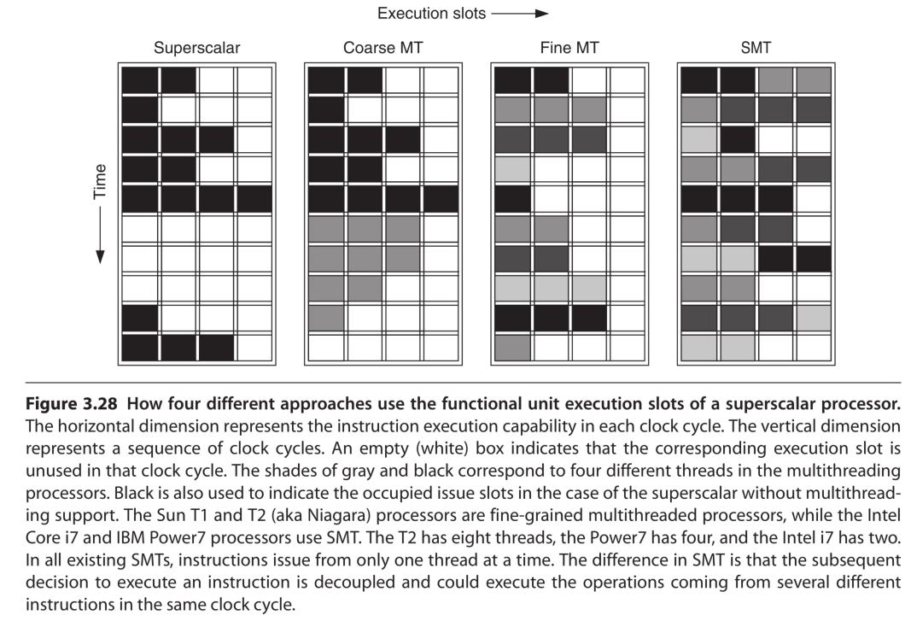

## Effectiveness of Fine-Grained Multithreading on the Sun T1

T1完全专注于开发线程级并行，使用多核和多线程来产生吞吐量

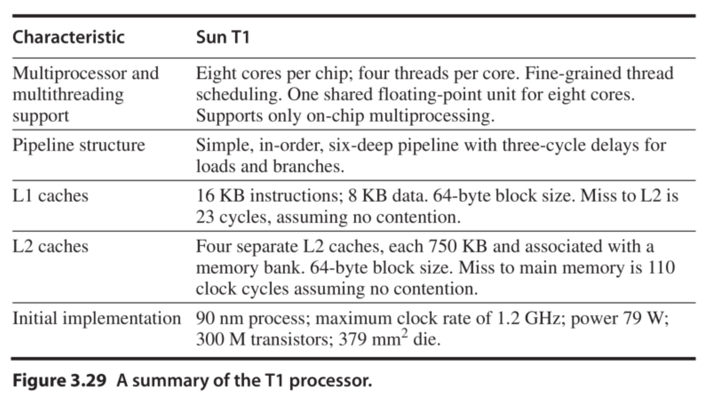

### T1 Multithreading Unicore Performance

为了检查T1的性能，使用三个面向服务器的基准测试：TPC-C、SPECJBB、SPECWeb99。

图3.30显示了TPC-C中，每核执行一个线程与每核执行四个线程时，失效率和观察到的失效等待时间的相对增加。

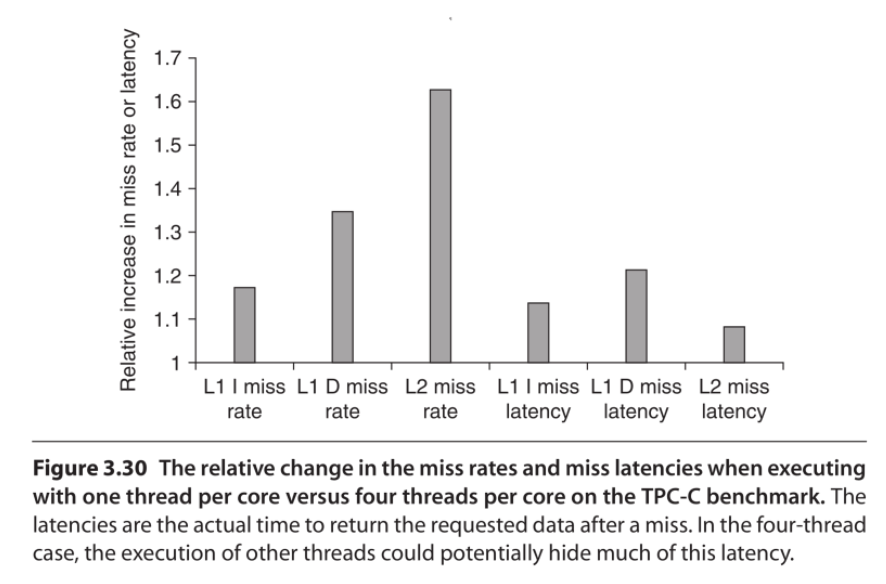

线程可能因为缓存丢失、流水线延迟以及各种较小的影响而无法就绪。

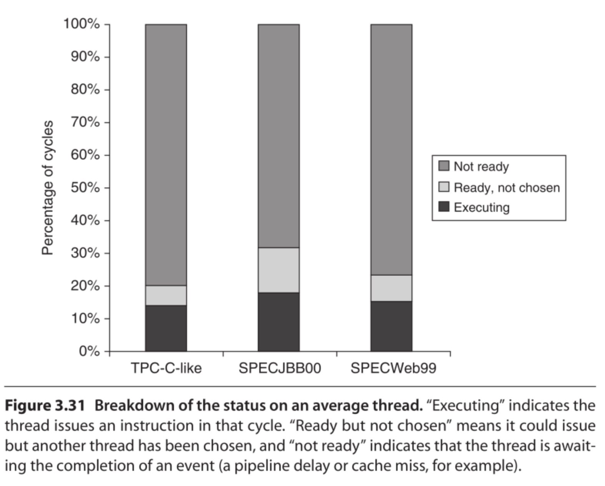

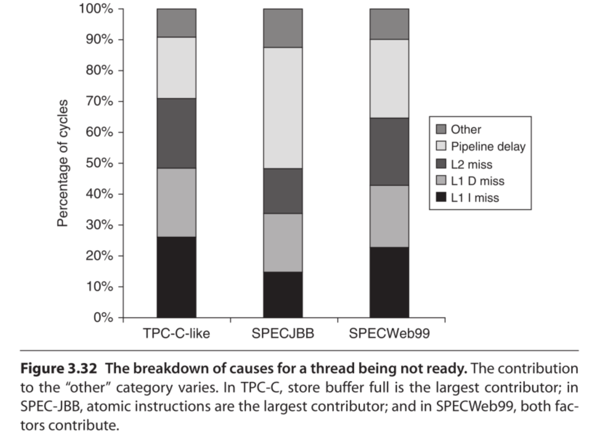

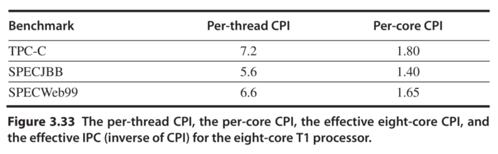

## Effectiveness of Simultaneous Multithreading on Superscalar Processors

SMT可以以==高效节能的方式提高性能==

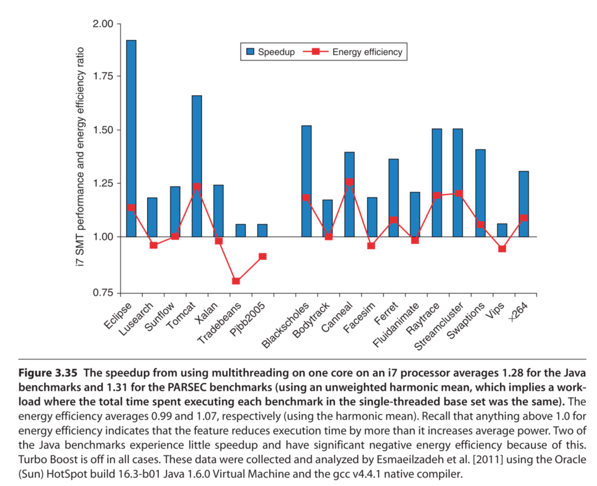

# 3.13 Putting it All Together: The Intel Core i7 and ARM Cortex-A8

## The ARM Cortex-A8

A8是一个两发射，静态调度超标量与动态检测，它允许处理器每个时钟周期发出一个或两个指令。

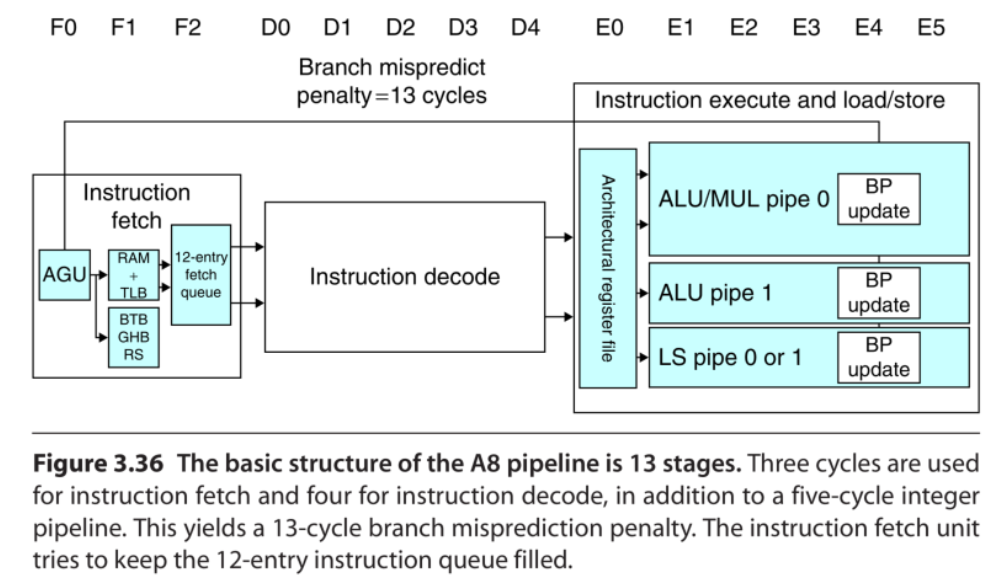

A8使用一个动态分支预测器，具有一个512输入双向集合关联分支目标缓冲区和一个4K输入全局历史缓冲区，该缓冲区由分支历史和当前PC进行索引。在分支目标缓冲区未命中的情况下，从全局历史缓冲区获得一个预测，然后可以使用该预测来计算分支地址。

图3.37显示了指译码流水线。每个时钟最多顺序发射两条指令，使用一个记分牌用于跟踪何时可以发出指令。

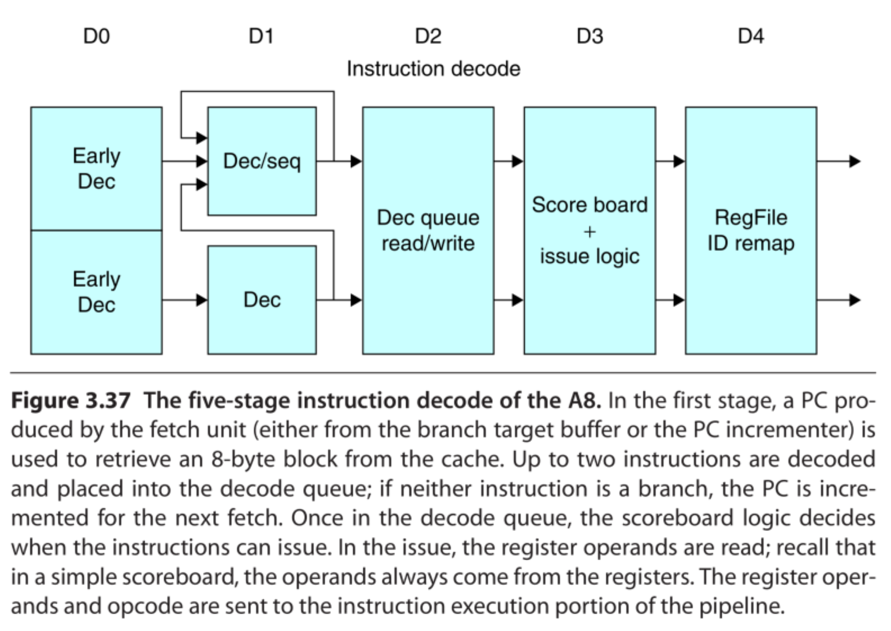

图3.38显示了执行流水线，指令1和指令2都可以进入加载/存储流水线，A8使用一个两发射静态调度超标量

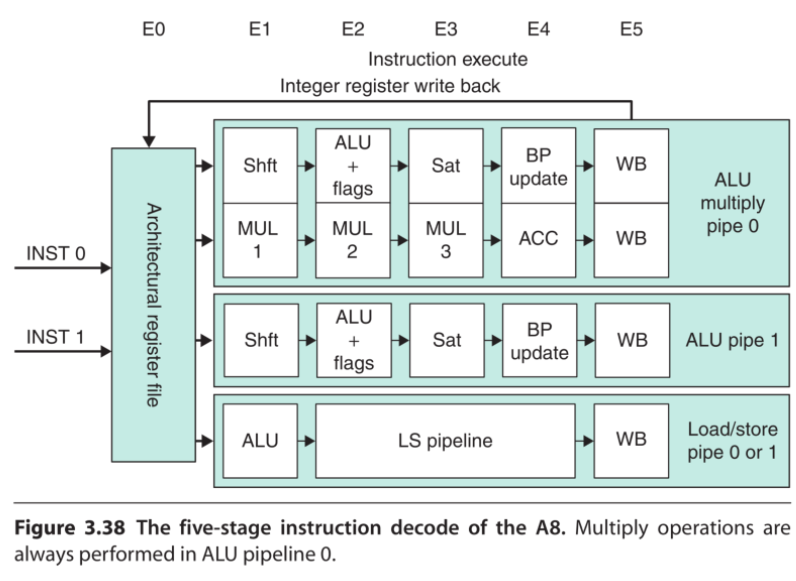

### Performance of the A8 Pipeline

由于A8的的双重发射结构，其理想的CPI为0.5。流水线停滞的原因有

-   功能相关，当相邻的两个指令同时使用了一个功能流水线
-   数据相关，在流水线早期检测得到
-   控制相关，当分支预测错误时出现

## The Interl Core i7

i7使用了==无序==推测微体系结构，具有很深的流水线，目的是结合多发射和高时钟率来实现高指令吞吐量。

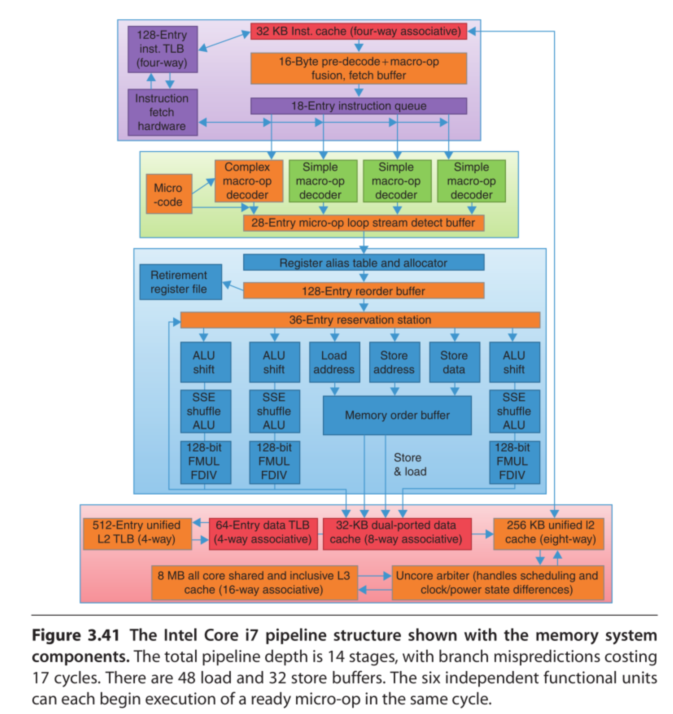

-   指令获取——处理器使用一个多级分支目标缓冲去实现速度和预测精度的平衡。使用一个返回地址堆栈加速函数返回
-   16个字节被放在一个预编码指令缓冲区中，执行一个宏操作融合的过程。
-   微操作解码——单个x86指令被转换成微操作（简单的MIPS类指令，可通过流水线直接执行）
-   微操作缓冲区循环流检测和微融合。微融合结合了load/ALU操作和ALU操作/存储等指令对，并放在一个单独的保留站中，增加了缓冲区的使用量
-   执行基本指令发射——在寄存器表中查找寄存器位置，重命名寄存器，分配重排序缓冲区，并将微操作发送到保留站之前从寄存器或重排序缓冲区获取结果
-   i7使用一个36入口的中央预定站，由6个功能单元共享。
-   微操作由各个功能单元执行，然后将结果发送回任何等待保留站以及寄存器单元。
-   当重排序缓冲区头部的一条或多条指令被标记为完成时，在寄存器

### Performance of the i7

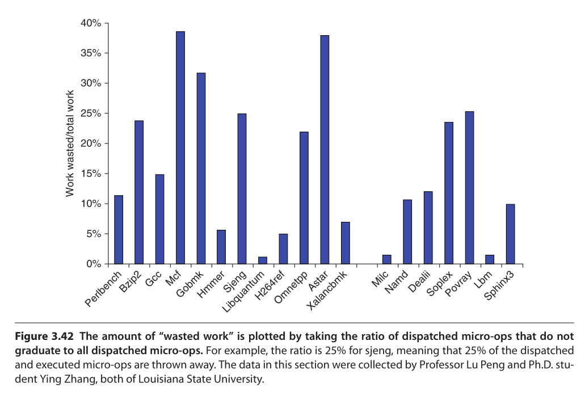

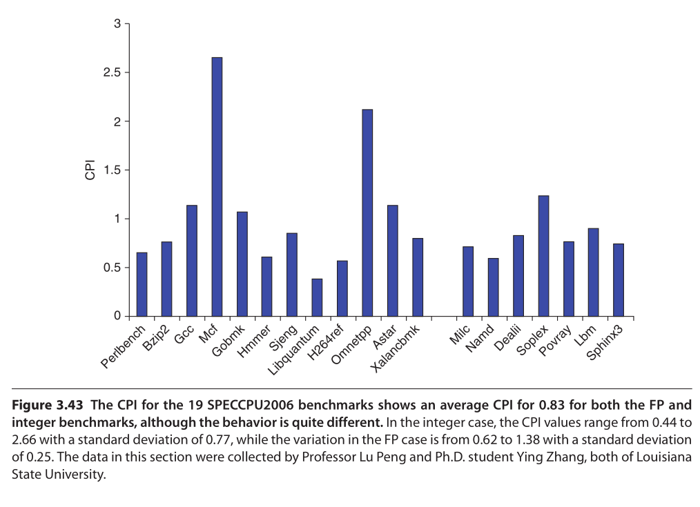

虽然i7的动态调度和非阻塞功能可以隐藏一些错过延迟，但缓存内存行为依然是主要原因。